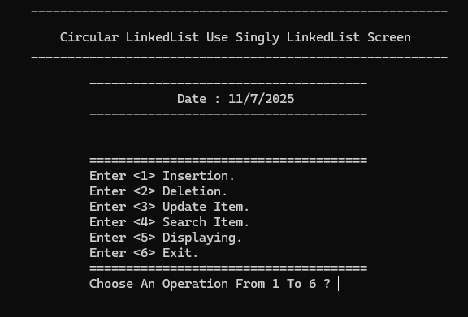
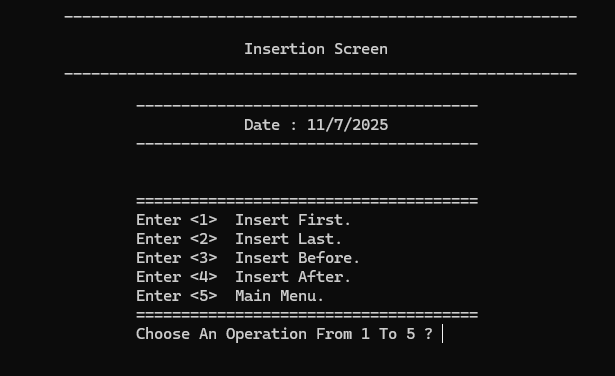
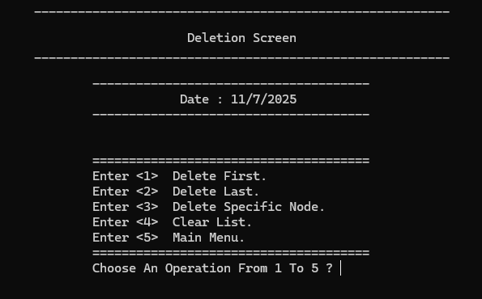
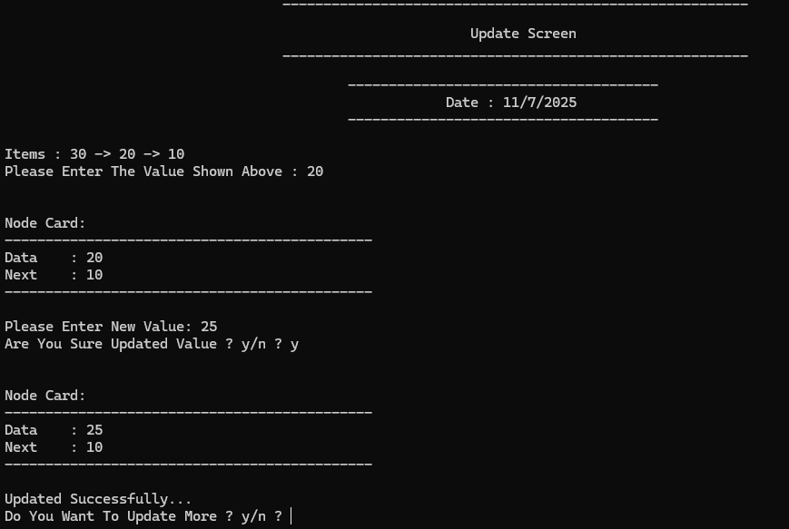
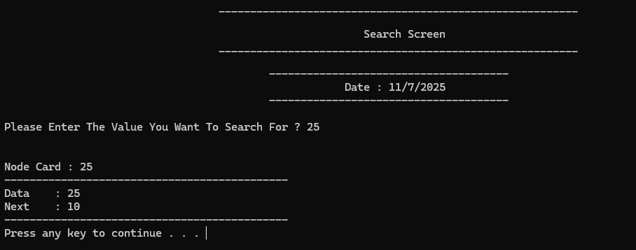
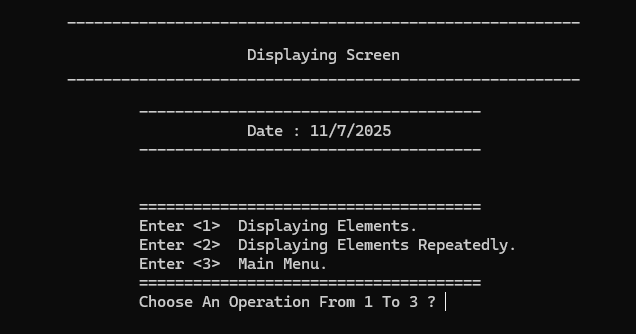

# Circular Singly Linked List  
**محاكاة شاملة لقائمة مرتبطة منفردة دائرية (Circular Linked List)**

---

## 💡 فكرة المشروع  
تطبيق عملي متكامل لهياكل البيانات من نوع القائمة المرتبطة المنفردة الدائرية باستخدام لغة C++.  
يشمل تنفيذ جميع العمليات الأساسية مثل الإضافة، الحذف، البحث، والطباعة من خلال واجهة نصية منظمة (CLI).  
الهدف هو تعزيز الفهم العميق لمفاهيم هياكل البيانات وإدارة الذاكرة اليدوية باستخدام المؤشرات.

---

## 🛠 الأدوات والتقنيات المستخدمة  
- **لغة البرمجة:** C++  
- **البرمجة الكائنية (OOP)**  
- **إدارة الذاكرة:** استخدام المؤشرات مع الحجز والتحرير اليدوي للذاكرة  
- **بيئة التطوير:** Visual Studio  
- **نمط التنفيذ:** واجهة نصية (CLI)  
- **التنظيم:** فصل الكود إلى ملفات رأسية وتنفيذية لسهولة التوسع والتنظيم

---

## 🧑‍💻 دوري كمطور  
- تحليل وتصميم شامل لجميع عمليات القائمة المرتبطة الدائرية  
- تنفيذ جميع الوظائف من الصفر:  
  - الإضافة (في البداية، النهاية، قبل عقدة معينة، بعد عقدة معينة)  
  - الحذف (من البداية، النهاية، وسط القائمة)  
  - البحث عن عقد معينة  
  - الطباعة والتنقل عبر القائمة الدائرية  
- ضمان ربط آخر عقدة بأول عقدة للحفاظ على طبيعة الهيكل الدائرية  
- تطوير واجهة CLI تفاعلية للمستخدم  
- إدارة الذاكرة يدويًا بطريقة آمنة باستخدام المؤشرات

---

## 🎯 الهدف من المشروع  
بناء نموذج عملي منظم واحترافي لقائمة مرتبطة منفردة دائرية يعزز القدرة على تطبيق المفاهيم النظرية في الواقع، مع التركيز على كفاءة الأداء، وضوح الكود، ونظافته.

---

### ملاحظة :
هيكل القائمة المرتبطة الدائرية يمكن تطبيقه باستخدام العقد المزدوجة أيضًا

---

## صور من النظام

### Main Menu

### Insertion Menu

### Deletion Menu

### Update Node

### Find Node

### Displaying Menu

---

- المطور : محمد أحمد أحمد صلاح الهزمي
- ايميل : alhazmimohammed663@gmail.com
